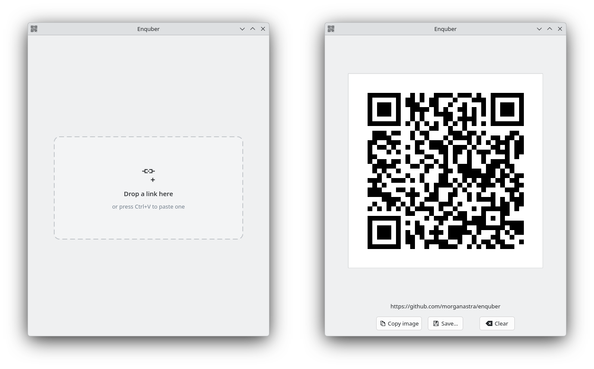

# enquber

Enquber is a simple QR code maker application with a nice UX and near-instant startup

Drop or paste text into the window to generate a QR code; then save or copy the resulting PNG

## Building

To build you need a functional qt6 development environment and `libqrencode`

On archlinux-like systems, that would be the following packages:

    base-devel cmake ninja qt6-base qrencode 

To run the smoke tests you also need

    zbar imagemagick xclip python-xlib

To build:

    cmake -S . -B build -G Ninja
    cmake --build build
    ./build/enquber

## Development

Everything except `main()` lives in a static library (`enquber_core`) 

Basic flow when a link is dropped or pasted:

1. `MainWindow::setText()` asks `qr::Code::encode()` for a symbol, which calls
   `QRcode_encodeString()` and hands back a shared, reference counted handle.
2. `QrView` picks the largest whole number of pixels per module that fits and
   rasterises the matrix once per size; `QrView::paintEvent()` just blits it.
3. The exports re-render at ~1024 px with `MainWindow::renderForExport()`.

### Debug Logging

You can log drag and drop events from the window's perspective with 
`QT_LOGGING_RULES="enquber.dnd.debug=true"`, or `qt.qpa.xdnd.debug=true`
to see Qt's xdnd messages directly.

### Testing

To run unit tests:

    ctest --test-dir build --output-on-failure

We also have a very luxurious smoke test setup which drives automated UI interactions against the real app.

Build with `ENQUBER_BUILD_TEST_TOOLS` turned on and run the smoke test script:

    cmake -S . -B build -G Ninja -DENQUBER_BUILD_TEST_TOOLS=ON
    cmake --build build
    tools/smoke.py --display :0

Smoke test screenshots are written to `$TMPDIR/enquber-smoke` 

## License

Copyright 2026 Morgan Astra

This program is free software: you can redistribute it and/or modify it under the terms of the GNU General Public License as published by the Free Software Foundation, either version 3 of the License, or (at your option) any later version.

This program is distributed in the hope that it will be useful, but WITHOUT ANY WARRANTY; without even the implied warranty of MERCHANTABILITY or FITNESS FOR A PARTICULAR PURPOSE. See the GNU General Public License for more details.

You should have received a copy of the GNU General Public License along with this program. If not, see <https://www.gnu.org/licenses/>. 

